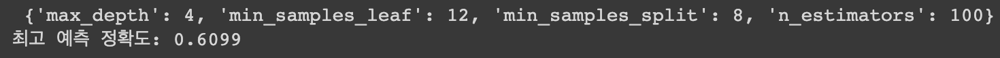
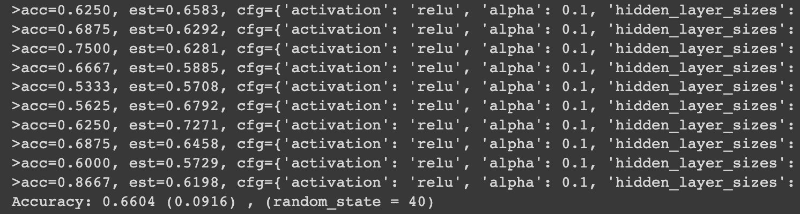
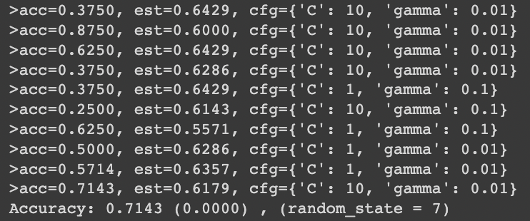

# Depressive_disorders_classification

organize 'classification of depressive disorders utilizing machine learning' study which I have done since 2021.08

---

-   학부 수준의 논문을 작성하기 위한 우울장애 분류 연구를 21년 8월부터 진행했습니다.
-   22-10-06 부로 연구를 마무리하였습니다.
-   연구한 내용들을 정리해서 업로드하며, 논문 작성을 마무리합니다.
-   Google Colab에서 소스 코드들을 작성하고, 실행 결과를 얻어냈습니다.
-   우울장애 분류작업을 위해 사용한 csv 형식의 파일은 비공개입니다.

---

### 21.08

-   매우 기본적인 딥러닝 모델에 우울증 분류 데이터가 적용되는지 확인하였습니다. ➡️ `classicMLP.py`
-   One-Hot encoding 방식을 사용하여 데이터의 Y Label(분류 결과)이 0과 3으로 나누어져 있는 부분을 고려하였습니다. 하지만, 분류 모델을 검증하기 위한 테스트 데이터 없이 학습(train)만 진행했기 때문에 유효한 결과를 얻지 못했습니다. ➡️ `classicMLP_LabelEncoder.py`

---

### 21.09

-   train_test_split 을 사용하여 학습데이터와 테스트데이터를 7:3 으로 나누고 학습을 진행하였으나, 유효한 결과를 얻지 못했습니다. ➡️ `classicMLP_trainTestSplit.py`
-   10CV (Cross-Validation, 교차검증) 기법을 사용하여 데이터셋을 기본적으로 10개의 조각(fold)으로 나누었습니다. 그 중 9개는 학습에, 1개는 테스트에 사용하는 방식을 총 10번 진행하였습니다. Stratified CV는 계층적 교차검증이라 일컫는데, 이는 이항 분류의 결과 값이 불균형할 때, 이를 계산하여 조각에 배치하지만 위 연구에서 효용성이 크지 않았습니다. 결과적으로 유효한 결과를 얻지 못했습니다. ➡️ `classicMLP_stratified10CV.py`
-   인공신경망(MLP)의 학습 결과의 신뢰도가 낮아 Scikit-Learn의 분류 관련 모듈들을 사용하여 분류를 진행하기로 하였습니다. 그 중, Random Forest Classifier를 사용하였고, 딕셔너리 목록으로 전달한 하이퍼 파라미터(사용자가 조작이 가능한 파라미터)를 GridSearchCV로 가장 좋은 하이퍼 파라미터 조합을 찾게 한 후 그 결과를 출력하였습니다. ➡️ `randomForest.py`
    

---

### 21.10

-   사이킷런에서 제공하는 MLPClassifier 모듈을 사용하여 학습을 진행하였습니다. (8 ~ 9월에 걸쳐 구현했던 인공신경망 딥러닝 모델과는 다릅니다.) Nested CV는 중첩 교차검증이라 일컫는데, outer와 inner 부분으로 나누어서 교차검증을 진행하므로 반복 수가 제곱이 됩니다. 그만큼 시간이 많이 걸린다는 단점과 Overfitting(과대적합)의 우려가 있었습니다. ➡️ `mlpClassifier.py`
    
-   사이킷런에서 제공하는 SVC(SVM) 모듈을 사용하여 학습을 진행하였습니다. Nested CV의 검증방식을 채택하였으나 0.59의 낮은 평균 정확도를 얻었습니다. ➡️ `SVM_NestedCV.py`
-   위 SVC(SVM) 모듈을 재사용하여 학습을 진행하였습니다. 기존의 Nested CV에 Stratified CV 검증방식을 혼합하였고, 0부터 9까지의 random_state(난수)에 따라 다르게 산출되는 정확도를 확인하였으나, 정확도의 편차가 너무 커서 신뢰성이 떨어지고, 학습 시간이 많으며, Overfitting의 우려가 있습니다. ➡️ `SVM_NestedStratifiedCV.py`
    
